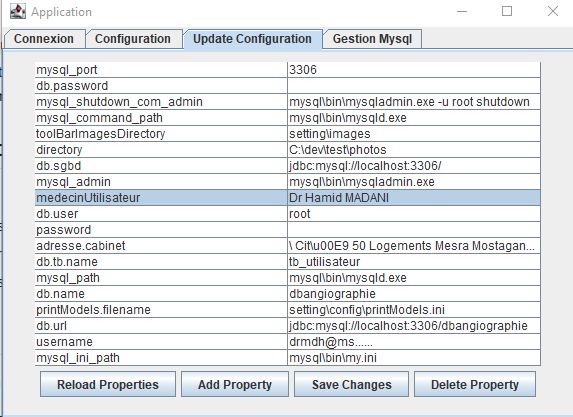
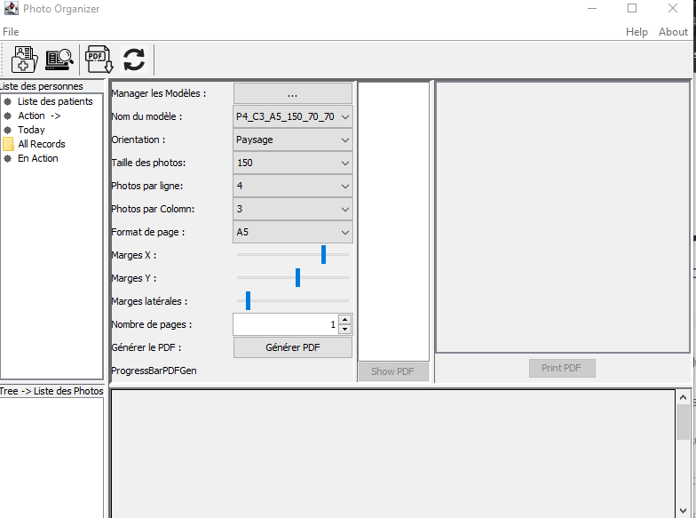
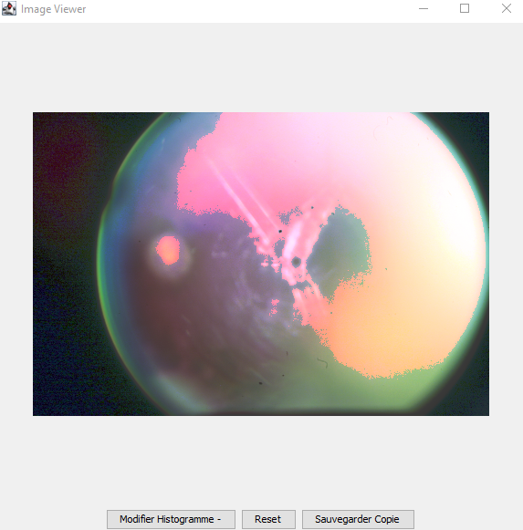
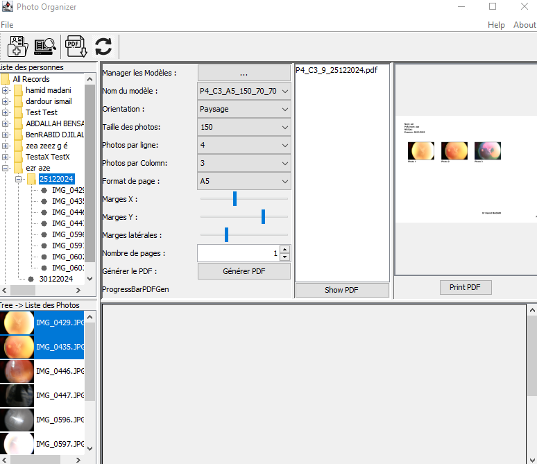
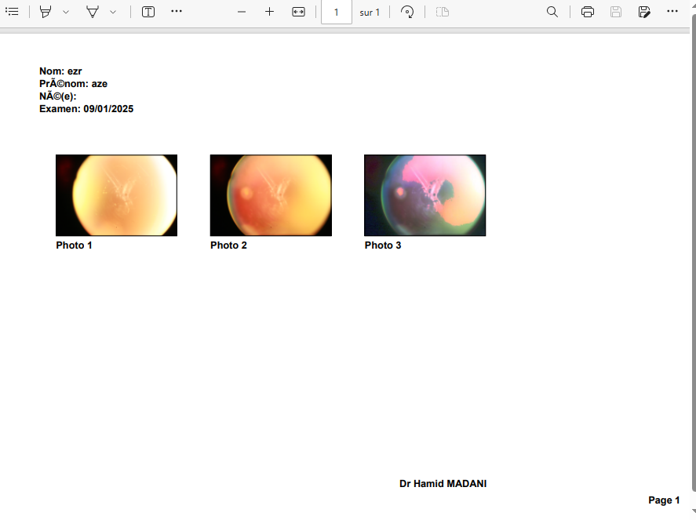

# Angioimage
## Motivation pour la création de l'application
L'idée de développer cette application est née d'un besoin concret et pressant dans ma pratique professionnelle. Je dispose d'un appareil d'angiographie rétinienne performant, mais j'ai malheureusement perdu le logiciel de gestion des photos qui l'accompagnait. Cette perte a considérablement perturbé mon flux de travail, rendant la gestion et l'analyse des clichés angiographiques beaucoup plus complexes.

Plutôt que d'opter pour une solution commerciale coûteuse ou inadaptée à mes besoins, j'ai décidé de relever un défi personnel : **concevoir une application sur mesure**. Mon objectif principal était de :

- Gérer efficacement les photos angiographiques ;
- Offrir des fonctionnalités d’analyse avancées ;
- Répondre spécifiquement aux besoins de mon cabinet.

Ce projet m’a permis de combiner mes compétences médicales et en développement logiciel pour créer une solution innovante. Il incarne également mon ambition d'utiliser les nouvelles technologies, y compris l’intelligence artificielle, pour améliorer la qualité des soins que je propose à mes patients.

En développant cette application, je n’ai pas seulement résolu un problème : j’ai découvert une véritable passion pour la conception d’outils mêlant santé et technologie, avec comme fil conducteur le bien-être de mes patients et l’amélioration de ma pratique professionnelle.

---

# Guide de démarrage de l'application

## 1. Vérification de la base de données

- Si la base de données n'est pas en cours d'exécution, une erreur de connexion sera signalée.
- Avant de démarrer l'application, assurez-vous que la base de données est correctement lancée.

## 2. Configuration des paramètres

- Toutes les informations de connexion (noms des tables, utilisateurs administrateurs et applicatifs, etc.) sont stockées dans le fichier : `settings/config/config.properties`.
- Vous pouvez modifier ce fichier directement ou utiliser l'onglet **"Update Configuration"** dans l'application, qui permet d’ajouter, modifier ou supprimer des variables et leurs valeurs.

## 3. Création de la base de données (si nécessaire)

- Si le SGBD est opérationnel mais que la base de données n'existe pas, l'application proposera de la créer.
- Lors de ce processus d’installation, les tables seront générées et remplies automatiquement.
- L'application demandera votre confirmation avant d'exécuter l’installation.
- En cas d'échec, vérifiez les paramètres de connexion (nom d’hôte ou port) et relancez l’installation.

## 4. Interface utilisateur

- Une fois la base de données créée ou la connexion établie, vous serez redirigé vers l'onglet **"Connexion"**.
- Après vous être connecté, l’interface utilisateur principale de l'application s’ouvrira automatiquement.

> **Note :** Assurez-vous que la base de données est configurée correctement pour éviter les erreurs au démarrage.

## 5. Saturation des couleurs
- modification de la saturation des images en couleur RGB
- 
## 5. Génération de PDF avec les photos
- 
- 

