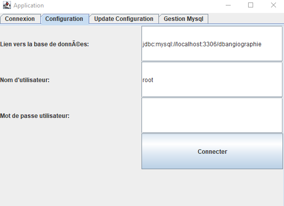
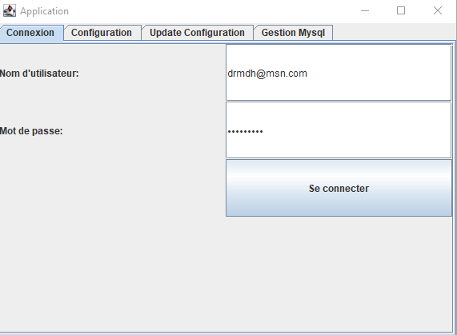
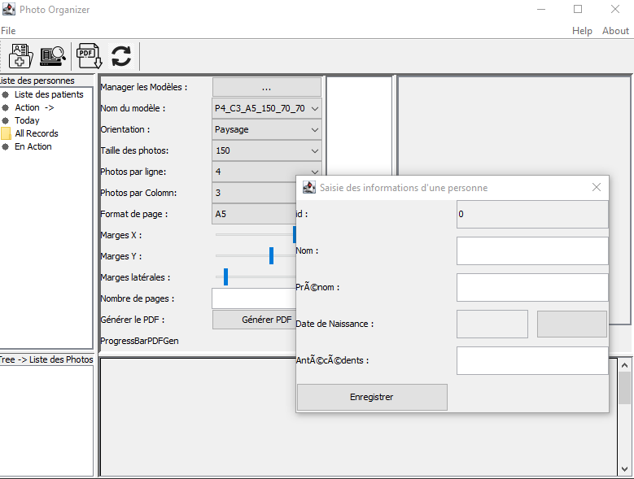
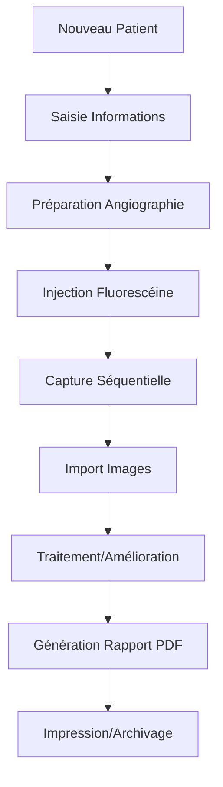

# 📸 Angioimage - Logiciel de Gestion d'Angiographie Topcon TRC-50DX


> **Logiciel professionnel de gestion et traitement d'images angiographiques pour remplacer le logiciel original perdu de l'angiographe Topcon TRC-50DX**

## 🎯 Motivation pour la création de l'application

L'idée de développer cette application est née d'un besoin concret et pressant dans ma pratique professionnelle. Je dispose d'un appareil d'angiographie rétinienne performant, mais j'ai malheureusement perdu le logiciel de gestion des photos qui l'accompagnait. Cette perte a considérablement perturbé mon flux de travail, rendant la gestion et l'analyse des clichés angiographiques beaucoup plus complexes.

Plutôt que d'opter pour une solution commerciale coûteuse ou inadaptée à mes besoins, j'ai décidé de relever un défi personnel : **concevoir une application sur mesure**. Mon objectif principal était de :

- 🏥 Gérer efficacement les dossiers patients et photos angiographiques
- 🎨 Offrir des fonctionnalités d'analyse et traitement d'images avancées
- 📊 Générer des rapports PDF professionnels personnalisables
- 💉 Supporter l'angiographie à la fluorescéine avec gestion temporelle
- 🔒 Assurer la sécurité et la confidentialité des données médicales

Ce projet m'a permis de combiner mes compétences médicales et en développement logiciel pour créer une solution innovante. Il incarne également mon ambition d'utiliser les nouvelles technologies, y compris l'intelligence artificielle, pour améliorer la qualité des soins que je propose à mes patients.

## 🏗️ Architecture du Système

### Architecture Générale
```
┌─────────────────────────────────────┐
│         COUCHE PRÉSENTATION         │
│     (Swing GUI, IHM Utilisateur)    │
├─────────────────────────────────────┤
│         COUCHE MÉTIER               │
│   (Services, Traitement d'images)   │
├─────────────────────────────────────┤
│         COUCHE DONNÉES              │
│      (DAO, Persistance, SGBD)       │
├─────────────────────────────────────┤
│         COUCHE INFRASTRUCTURE       │
│  (Configuration, Sécurité, Utils)   │
└─────────────────────────────────────┘
```

### Diagramme des Composants
```
┌─────────────────┐    ┌─────────────────┐    ┌─────────────────┐
│   Swing GUI     │    │  Configuration  │    │   PDF Reports   │
│                 │    │    Manager      │    │    Generator    │
├─────────────────┤    ├─────────────────┤    ├─────────────────┤
│ - PhotoOrganizer│◄───┤ - Config.java   │    │ - PDFCreator    │
│   App           │    │ - Properties    │    │ - PDFBox API    │
│ - Tree Views    │    │ - Encryption    │    │ - Page Layout   │
│ - Image Viewer  │    └─────────────────┘    └─────────────────┘
└─────────────────┘                                     ▲
         │                                              │
         ▼                                              │
┌─────────────────┐    ┌─────────────────┐    ┌─────────────────┐
│ Image Processing│    │   Data Access   │    │   File System   │
│                 │    │     Layer       │    │    Manager      │
├─────────────────┤    ├─────────────────┤    ├─────────────────┤
│ - Histogram EQ  │    │ - PersonDAO     │    │ - Directory     │
│ - RGB Adjustment│◄───┤ - UserDAO       │◄───┤   Structure     │
│ - Thumbnailator │    │ - ConfigDAO     │    │ - File Storage  │
│ - Image Filters │    │ - Database      │    │ - Backup        │
└─────────────────┘    └─────────────────┘    └─────────────────┘
                                ▲
                                │
                       ┌─────────────────┐
                       │    Database     │
                       │   (MySQL/H2)    │
                       ├─────────────────┤
                       │ - Users Table   │
                       │ - Persons Table │
                       │ - Config Table  │
                       └─────────────────┘
```

### Structure des Packages
```
org.hmd.angio/
├── 📁 conf/           # Configuration et propriétés système
├── 📁 dto/            # Objets de données (Person, User)
├── 📁 ihm/            # Interfaces utilisateur Swing
│   └── tree/          # Composants arborescence
├── 📁 pdf/            # Génération de rapports PDF
├── 📁 search/         # Fonctions de recherche patients
├── 📁 security/       # Chiffrement et authentification
├── 📁 install/        # Installation et gestion SGBD
│   └── sgbd/          # Managers base de données
└── 📁 exception/      # Gestion des exceptions métier
```

## ✨ Fonctionnalités Principales

### 👥 Gestion des Patients
- ➕ Ajout, modification, suppression de patients
- 🔍 Recherche avancée par nom/prénom
- 📁 Organisation automatique des dossiers
- 🔐 Authentification sécurisée

### 🖼️ Gestion des Images
- 📤 Import multi-formats (JPG, PNG, BMP, GIF)
- 🖱️ Visualisation avec zoom et navigation
- 📋 Affichage en miniatures et pleine résolution
- 🗂️ Organisation par patient et date d'examen

### 🎨 Traitement d'Images Avancé
- ⚖️ Égalisation d'histogramme automatique
- 🌈 Ajustement des couleurs RVB en temps réel
- 💾 Sauvegarde des modifications avec versioning
- 🔄 Prévisualisation instantanée des changements

### 💉 Angiographie à la Fluorescéine
- ⏱️ Gestion des séquences temporelles
- 📸 Capture automatique selon le timing d'injection
- 🔄 Organisation par phases (précoce, intermédiaire, tardive)
- ⏲️ Chronométrage précis pour diagnostic

### 📄 Génération de Rapports PDF
- 📐 Formats personnalisables (A4, A5, Letter)
- 🔄 Orientations portrait/paysage
- 📊 Mise en page configurable (photos par ligne, marges)
- 🖨️ Impression directe et export

## 🛠️ Technologies Utilisées

| Technologie | Version | Usage |
|-------------|---------|-------|
| **Java** | 17+ | Langage principal |
| **Swing** | Built-in | Interface utilisateur |
| **Maven** | 3.x | Build et gestion dépendances |
| **MySQL** | 8.0+ | Base de données production |
| **H2** | 2.2.224 | Base de données test |
| **PDFBox** | 2.0.30 | Génération PDF |
| **Thumbnailator** | 0.4.20 | Traitement d'images |
| **BouncyCastle** | 1.77 | Chiffrement |

## 🗄️ Schéma de Base de Données

```sql
-- Table des utilisateurs
CREATE TABLE users (
    id INT PRIMARY KEY AUTO_INCREMENT,
    username VARCHAR(50) UNIQUE NOT NULL,
    password VARCHAR(255) NOT NULL,
    created_date TIMESTAMP DEFAULT CURRENT_TIMESTAMP
);

-- Table des patients
CREATE TABLE persons (
    id INT PRIMARY KEY AUTO_INCREMENT,
    nom VARCHAR(100) NOT NULL,
    prenom VARCHAR(100) NOT NULL,
    date_naissance DATE NOT NULL,
    created_date TIMESTAMP DEFAULT CURRENT_TIMESTAMP
);

-- Table de configuration
CREATE TABLE config (
    property_key VARCHAR(100) PRIMARY KEY,
    property_value TEXT,
    description VARCHAR(255)
);
```

### Organisation des Fichiers
```
workspace/
├── patients/
│   ├── {id}_{nom}_{prenom}/
│   │   ├── {date_examen}/
│   │   │   ├── original_images/
│   │   │   ├── modified_images/
│   │   │   └── thumbnails/
│   │   └── reports/
│   │       └── {date}_report.pdf
└── backup/
```

## 🚀 Installation et Configuration

### Prérequis
- ☕ Java 17 ou supérieur
- 🗄️ MySQL 8.0+ (ou H2 pour les tests)
- 📦 Maven 3.x
- 🖥️ OS : Windows 10+, Linux Ubuntu 20.04+

### Étapes d'Installation

1. **Cloner le repository**
   ```bash
   git clone https://github.com/votre-repo/angioimage.git
   cd angioimage
   ```

2. **Configuration de la base de données**
   - Assurez-vous que MySQL est en cours d'exécution
   - Les paramètres de connexion se trouvent dans `settings/config/config.properties`

3. **Build et lancement**
   ```bash
   cd Angiographie
   mvn clean compile
   mvn exec:java -Dexec.mainClass="org.hmd.angio.ApplicationGUI"
   ```

---

# 📋 Guide de démarrage de l'application

## 1. Vérification de la base de données

- Si la base de données n'est pas en cours d'exécution, une erreur de connexion sera signalée.
- Avant de démarrer l'application, assurez-vous que la base de données est correctement lancée.

## 2. Configuration des paramètres

- Toutes les informations de connexion (noms des tables, utilisateurs administrateurs et applicatifs, etc.) sont stockées dans le fichier : `settings/config/config.properties`.
- Vous pouvez modifier ce fichier directement ou utiliser l'onglet **"Update Configuration"** dans l'application, qui permet d'ajouter, modifier ou supprimer des variables et leurs valeurs.


## 3. Création de la base de données (si nécessaire)

- Si le SGBD est opérationnel mais que la base de données n'existe pas, l'application proposera de la créer.
- Lors de ce processus d'installation, les tables seront générées et remplies automatiquement.
- L'application demandera votre confirmation avant d'exécuter l'installation.
- En cas d'échec, vérifiez les paramètres de connexion (nom d'hôte ou port) et relancez l'installation.



## 4. Interface utilisateur

- Une fois la base de données créée ou la connexion établie, vous serez redirigé vers l'onglet **"Connexion"**.
- Après vous être connecté, l'interface utilisateur principale de l'application s'ouvrira automatiquement.




> **Note :** Assurez-vous que la base de données est configurée correctement pour éviter les erreurs au démarrage.

## 5. Import et gestion des images

L'application permet d'importer facilement les photos d'angiographie depuis votre angiographe Topcon TRC-50DX :


## 6. Ajout d'un nouveau patient

L'interface de saisie permet d'enregistrer rapidement les informations des nouveaux patients :



## 7. Traitement des images - Saturation des couleurs

L'éditeur intégré permet la modification de la saturation des images en couleur RGB avec prévisualisation en temps réel :


- **Réglages individuels** : Contrôle séparé des canaux Rouge, Vert, Bleu
- **Prévisualisation instantanée** : Voir les modifications en temps réel
- **Sauvegarde sélective** : Conserver uniquement les améliorations souhaitées

## 8. Génération de rapports PDF

L'application génère des rapports PDF professionnels personnalisables avec les photos sélectionnées :


**Fonctionnalités PDF :**
- 📄 Formats de page multiples (A4, A5, Letter)
- 📐 Orientations portrait et paysage
- 🖼️ Nombre de photos par ligne configurable
- 📏 Marges ajustables
- 👤 Informations patient automatiquement intégrées
- 🖨️ Impression directe et export

## 🔒 Sécurité et Confidentialité

- **Chiffrement AES-256** : Toutes les configurations sensibles sont chiffrées
- **Authentification robuste** : Système de login sécurisé avec gestion des sessions
- **Conformité médicale** : Respect des normes de confidentialité des données patients
- **Sauvegarde automatique** : Protection contre la perte de données

## 📈 Workflow Clinique Type



## 🤝 Compatibilité Angiographe

✅ **Topcon TRC-50DX** - Support complet  
✅ **Formats d'images** - JPG, PNG, BMP, GIF  
✅ **Angiographie fluorescéine** - Séquences temporelles  
✅ **Éclairages spéciaux** - Lumière bleue, verte  

## 📚 Documentation Technique

- 📖 [Document de Conception](Documents/Document_de_Conception.md)
- 🏗️ [Document d'Architecture](ocuments/Document_Architecture.md)
- 🧪 [Plan de Test](ocuments/Plan_de_Test.md)

## 🔧 Maintenance et Support

Pour toute question technique ou demande d'amélioration, consultez la documentation technique ou contactez l'équipe de développement.

---

**Développé avec passion pour améliorer la pratique de l'angiographie ophtalmologique** 👁️‍🗨️